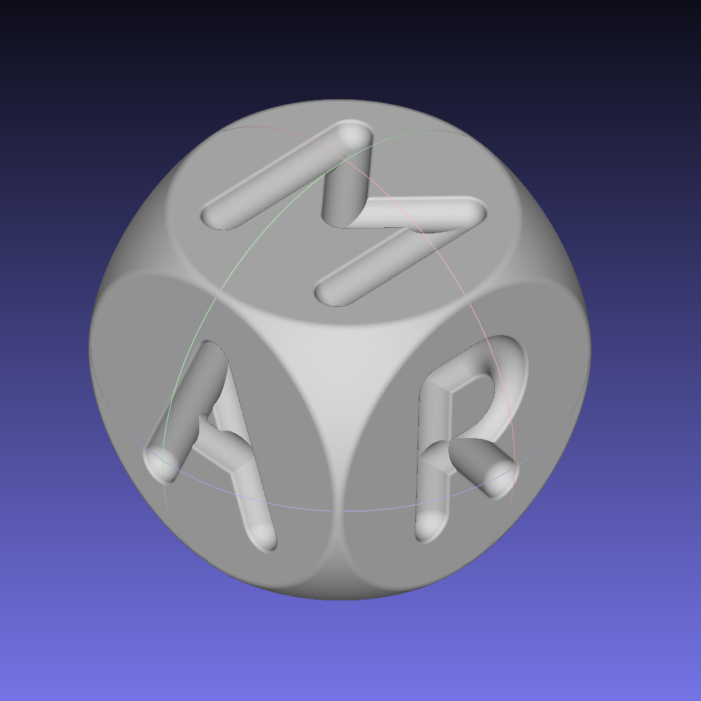
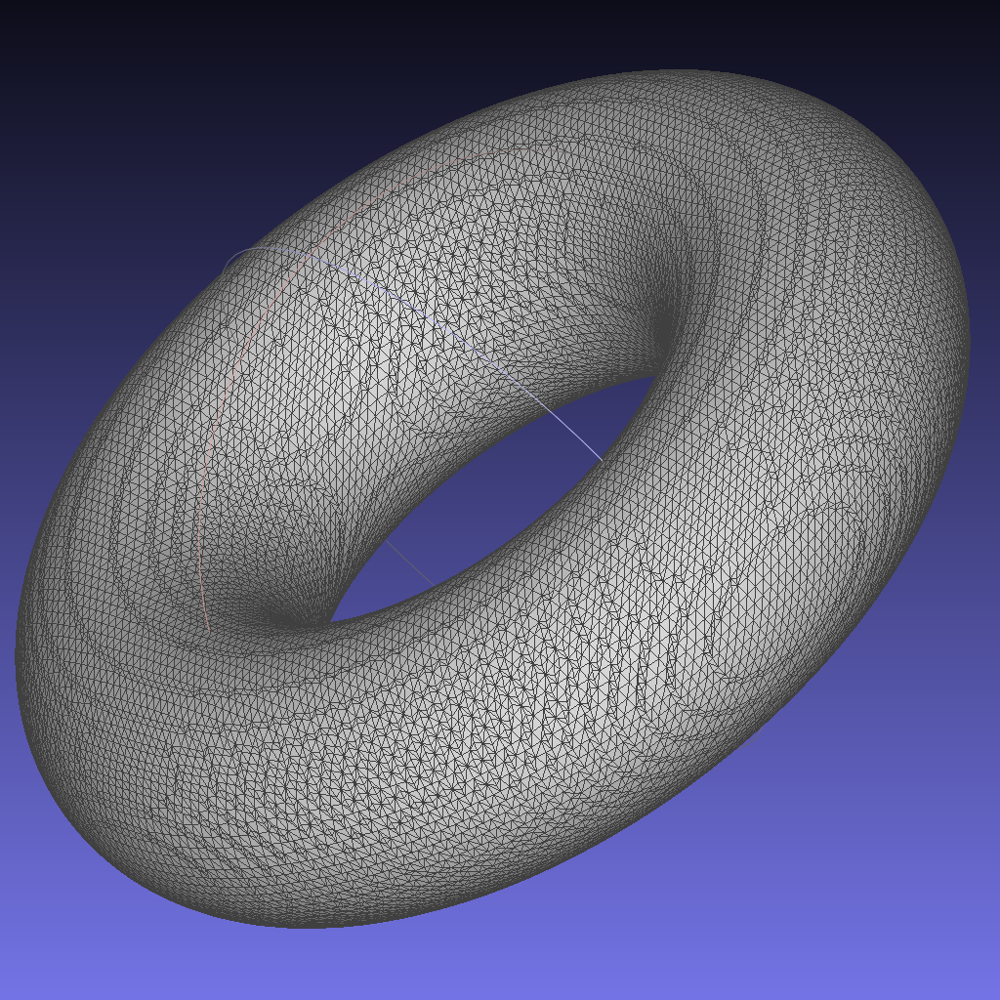
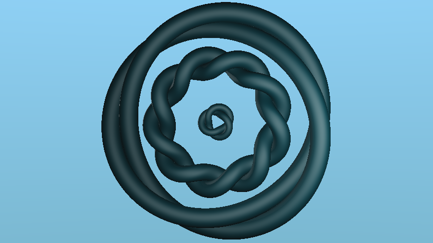
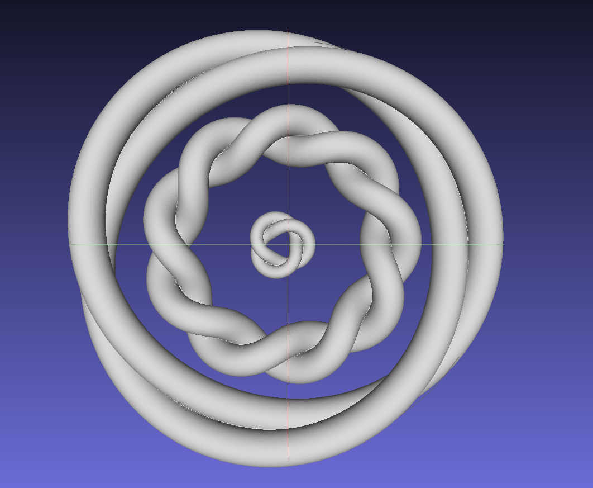

# sdf2mesh

**sdf2mesh** generates triangle meshes from [SDFs](https://www.wikiwand.com/en/Signed_distance_function) defined as WGSL shaders using dual contouring and [WGPU](https://github.com/gfx-rs/wgpu).

**sdf2mesh** also can read shaders from [ShaderToy](https://shadertoy.com), see below.



## TL;DR

This example reads an SDF defined a file `examples/torus.sdf3d`, renders it with resolution 128x128x128 and writes it to `torus.stl`.
The resulting STL file can be viewed in a mesh viewer, like [MeshLab](https://www.meshlab.net/).

```shell
 cargo run -- --sdf examples/torus.sdf3d  --resolution 128 --mesh torus.stl
```

You can also generate a mesh from ShaderToy:

```shell
cargo run --release -- --shadertoy-id DldfR7 --resolution 256 --mesh shadertoy.stl --bounds 5
```

## How it works

### What is an SDF?

Imagine you have a solid figure, like a sphere or a box. The *signed distance function* (SDF) for a point in space tells you how far away that point is from the nearest point on the boundary of the shape.

Now, the "signed" part is what makes it interesting. It not only tells you the distance but also whether the point is inside or outside the shape. If the point is inside, the distance is negative, and if it's outside, the distance is positive. If the point is exactly on the boundary, the distance is zero.

So, in simple terms, a signed distance function is like a magic function that, for any point in space, tells you both how far away you are from the nearest point on a shape and whether you're inside or outside that shape. It's a useful concept in computer graphics, physics simulations, and other fields where understanding distances to solid figure is important.

### SDF definition

The SDF is defined in an input file with extension `sdf3d`.
The file actually contains WGSL code.
A definition for a torus with radius 0.5 and width 0.2 looks like this:

```wgsl
use sdf3d::*;

fn sdf3d(p: vec3f) -> f32 {
    return sdf3d_torus(p, vec2(0.5, 0.2));
}
```

`use sdf3d::*` imports a set of functions for primitives. The function `sdf3d_torus` is such a predefined primitive.
The `sdf3d` function defines the actual SDF and has a position as input and a distance value as output.
That's all!

### SDF rendering

In order to convert the SDF into a triangle mesh, we need evaluate the SDF for each cell (X,Y,Z) with a certain resolution.
If the signs are different for the corners of the cell, we have to generate triangles.

This process is called [*Dual Contouring*](https://www.cs.wustl.edu/~taoju/research/dualContour.pdf).
You can find a nice visualization of the process [here](https://www.youtube.com/watch?v=B_5VBtpVuLQ).

In order to save memory, this process is done slice by slice instead rendering the SDF into a voxel grid.

### Running sdf2mesh

If we run the app with

```shell
 cargo run -- --sdf examples/torus.sdf3d  --resolution 128 --mesh torus.stl
```

We get the following output:



### Generating a Mesh from ShaderToy fragment shader



```shell
cargo run -- --shadertoy-id XX3Xzl  --resolution 512 --mesh shadertoy.stl --debug-wgsl test.wgsl --bounds 2 --shadertoy-sdf map --shadertoy-sdf-normal estimateNormal
```

The shader must have at least two functions:

* `float sdf(vec3 p)`: This function calculates the SDF. In the example above, we can use the `--shadertoy-sdf` to use a different name, e.g. `map`. However, while the name of the function can be arbitrary, its signature must always be `float (vec3 p)`.
* `vec3 normal(vec3 p, float eps)`: This function estimates the normal of the SDF. In the example above, we can use the `--shadertoy-sdf-normal` to use a different name, e.g. `estimateNormal`. While the name of the function can be arbitrary, its signature must always be `vec3 (vec3 p, float eps)`.

The shader will be download via ShaderToy API and will be converted from GLSL to WGSL using [naga](https://github.com/gfx-rs/wgpu/tree/trunk/naga).

Some more considerations:

* Because the shader is compiled from GLSL to WGSL, compilation might fail in certain cases. Use the debug option `--debug-wgsl test.wgsl` to write the resulting WGSL into `test.wgsl` to spot possible errors. (Filing issues is welcome :)
* Buffers and Channels are not supported (yet).
* Make sure you use a proper bounding box that fits the size of your SDF. The command line argument `--bounds 2` will create a centered bounding box with size `2`. This also means you SDF should be always centered.
* Meshes grow *O(n^3)* with resolution. This means, a mesh generated with resolution of 2048 can become several GBs in size!
* The dual-contouring algorithm still has some problems with certain triangle constellations and precision. In this case, an invalid quad will be created and the mesh will have a hole. This happens more often with higher resolutions.
* Use post-processing to simplify and possibly fix your mesh.
* If you can to use your custom shader from ShaderToy, make sure you **public + API** setting when publishing.



## TODO

* SDF viewer app
* Rendering estimation
* Better error handling
* More primitives and built-in functions

## Known issues

* When the SDF is out of bounds, mesh generation might fail
* Crashes with resolutions above 2048 pixels
